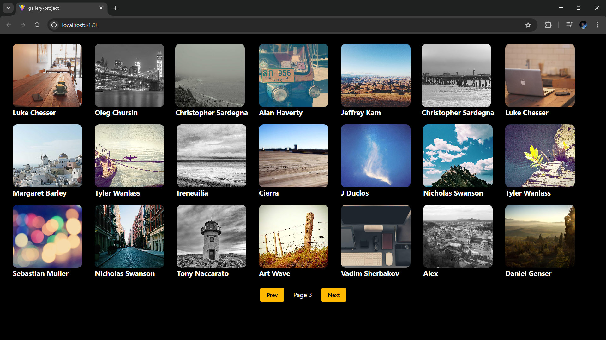

## Gallery Project (React + Axios)

A small **toy project** built while learning how to **fetch data from an API using Axios** and manage it with **React hooks** like `useEffect` and `useState`.  
The goal of this project was hands-on learning through implementation rather than building a large-scale application.

---

## Preview



---

## Features

- Fetches images from an external API using **Axios**
- Uses **useEffect** for API calls on component mount
- Manages data and pagination state with **useState**
- Clean **gallery layout** with image cards
- **Page-based navigation** (Prev / Next)
- Dark-themed UI for better visual focus

---

## Tech Stack

- React (Vite)
- Axios
- JavaScript (ES6+)
- CSS / Tailwind (if applicable)

---

## What I Learned

- Making API requests with Axios
- Handling side effects using `useEffect`
- Managing component state with `useState`
- Implementing simple pagination logic
- Structuring a React project for readability
- Rendering dynamic data using `.map()`

---

## Getting Started

1. Clone the repository
   ```bash
   git clone https://github.com/AnkitBarmola/gallery-project.git
